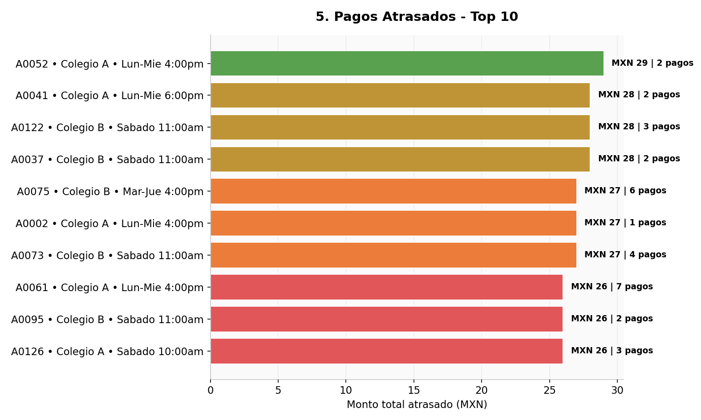

## Query 5: ¿Qué alumnos tienen pagos atrasados y cuál es la cartera vencida?

### Objetivo del análisis
Identificar a los alumnos con mensualidades vencidas para medir el nivel de cartera atrasada, priorizar la cobranza y detectar focos de riesgo financiero antes de que el atraso se convierta en una baja definitiva.

### Lectura de los resultados
La consulta agrupa los registros de la tabla de mensualidades con estatus `atrasado` y resume por alumno:

- cuántos pagos tiene vencidos,
- cuánto dinero acumula en atraso,
- cuál es el mes más antiguo sin cubrir,
- cuál es el mes más reciente con atraso,
- y cuántos meses de antigüedad tiene la deuda más vieja.

### Gráfica de apoyo

### Hallazgos clave

1. **La deuda se concentra en pocos alumnos.**
	Los primeros registros del reporte muestran alumnos con 7, 6 y 5 pagos atrasados, lo que indica que no se trata de atrasos aislados sino de cuentas con rezago acumulado.

2. **Hay alumnos con cartera vencida alta y persistente.**
	Los montos acumulados más altos llegan a 3,850 y 3,300 unidades monetarias, lo que sugiere una falta de seguimiento oportuno antes de que el atraso crezca.

3. **La antigüedad del atraso ya es relevante.**
	En varios casos, la deuda más antigua se remonta a más de 20 meses, señal de que el problema no es reciente y probablemente requiere intervención directa.

4. **El atraso no está aislado por grupo.**
	Los registros aparecen repartidos entre distintos colegios y horarios, así que el problema es transversal y no exclusivo de una sola sede.

### Interpretación ejecutiva
Este reporte funciona como un semáforo financiero. Un alumno con varios pagos atrasados no solo representa un ingreso pendiente, sino también una señal temprana de desconexión con el servicio. Cuando el atraso se vuelve recurrente, aumenta la probabilidad de baja, por lo que la cartera vencida debe revisarse junto con el estado académico y la asistencia.

### Conclusión
La Query 5 confirma que existe una cartera vencida significativa y concentrada en ciertos alumnos con atrasos repetidos y de larga antigüedad. La prioridad no debe ser revisar todos los casos por igual, sino enfocar la cobranza en quienes combinan **más pagos vencidos**, **mayor monto total** y **más meses de atraso**. Si se atienden a tiempo estos casos, se puede recuperar ingreso y al mismo tiempo reducir el riesgo de deserción.

### Acción sugerida
- Contactar primero a los alumnos con mayor monto total atrasado.
- Dar prioridad a los casos con mayor antigüedad de deuda.
- Cruzar este reporte con asistencia y estado del alumno para detectar si el atraso ya está afectando la permanencia.
