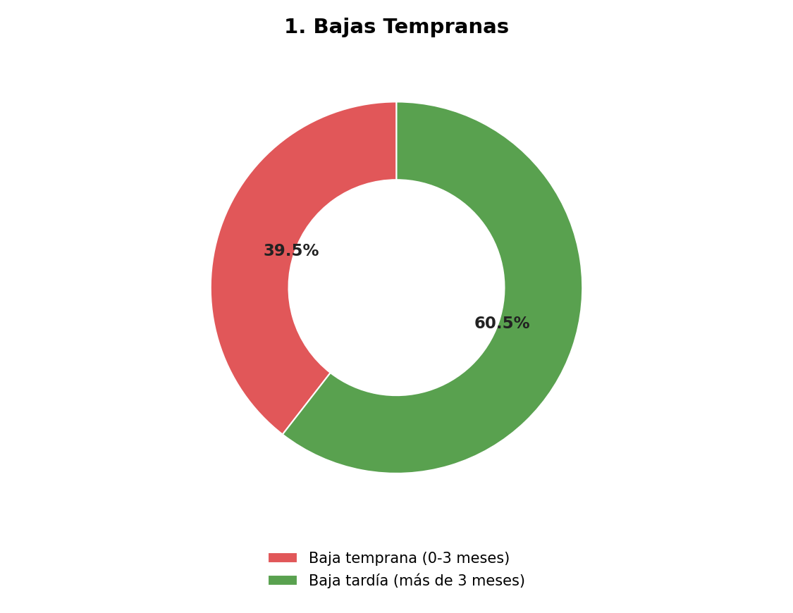

# 📊 Hallazgos y Recomendaciones — Análisis de Retención

Este documento profundiza en los 4 hallazgos principales del proyecto, con contexto,
posibles causas, y recomendaciones accionables para una academia real.

---

## 1. El 39.5% de las bajas ocurren en los primeros 3 meses

**Lo que dice el dato**: casi 4 de cada 10 alumnos que se dan de baja, lo hacen antes
de cumplir 90 días inscritos.

**Posible causa**: los primeros meses son los de mayor fricción — el alumno todavía no
genera el hábito, no ha vivido un logro visible (ej. cambio de cinta), y la motivación
inicial (a veces impulsada por los papás, no por el niño) puede decaer rápido si no hay
refuerzo activo.

**Recomendación accionable**:
- Checkpoint de seguimiento en semana 4 (llamada o mensaje a los padres preguntando cómo
  va la experiencia)
- Reconocimiento visible temprano: un sistema de "primeros logros" (ej. primera patada
  correcta, primera clase completa) antes del primer examen de cinta formal
- Medir esta tasa cada trimestre para saber si las intervenciones están funcionando

---

## 2. Los horarios de 4:00pm retienen 30 puntos porcentuales menos que los sábados

**Lo que dice el dato**: sábado 10am tiene 90.9% de retención, mientras que los horarios
de 4pm entre semana caen a 59-60%.

**Posible causa**: los alumnos de 4pm llegan directo de la jornada escolar — cansancio
físico y mental reduce tanto el disfrute de la clase como la disposición de los padres a
sostener la rutina a largo plazo.

**Recomendación accionable**:
- Si es operativamente viable, evaluar mover grupos de 4pm a un horario posterior
  (5:30-6:00pm), dando un colchón de descanso
- Si no se puede mover el horario, ajustar la primera parte de esa clase específica con
  una dinámica de menor exigencia física antes de entrar al contenido técnico
- Usar este dato como criterio al momento de ofrecer horarios a alumnos nuevos —
  priorizar cupo en los horarios de mejor retención cuando sea posible

---

## 3. Enero y junio concentran más bajas que el resto del año

**Lo que dice el dato**: los picos de bajas coinciden con el regreso de vacaciones de
invierno (enero) y el fin de ciclo escolar (junio).

**Posible causa**: en enero, la rutina se rompe durante las vacaciones y cuesta
retomarla; en junio, coincide con el cierre del ciclo escolar y posibles cambios de
planes familiares para el verano.

**Recomendación accionable**:
- Campaña de "recordatorio de regreso" 2 semanas antes de que terminen las vacaciones de
  invierno, en vez de esperar a ver quién no regresa
- En junio, ofrecer una promoción o plan de verano que dé continuidad en vez de una
  pausa total (ej. clases de verano con menor frecuencia, pero que mantengan el vínculo)
- Anticipar estos meses en la planeación en vez de reaccionar cuando ya bajó la
  inscripción

---

## 4. La asistencia cae antes de que un alumno se dé de baja — señal de alerta temprana

**Lo que dice el dato**: en las últimas 4 semanas antes de darse de baja, la asistencia
promedio cae de forma marcada comparado con el resto del periodo que el alumno estuvo
inscrito.

**Posible causa**: la baja de asistencia no es la causa de la baja formal, es un síntoma
que la antecede — el alumno (o la familia) ya está perdiendo el compromiso antes de
comunicarlo formalmente.

**Recomendación accionable — la más valiosa del análisis**:
- Este hallazgo convierte la asistencia en un **indicador predictivo**, no solo
  descriptivo. Un sistema simple de alerta (ej. "2 o más faltas en 2 semanas
  consecutivas → contacto directo con el padre/alumno") podría anticipar bajas antes de
  que ocurran, en vez de enterarse cuando ya es demasiado tarde para retener al alumno
- Esto es exactamente el tipo de análisis que justifica llevar un registro digital de
  asistencia consistente, en vez de solo llevarlo en papel

---

## Conclusión general

Los 4 hallazgos apuntan a una idea central: **la retención no es aleatoria, tiene
patrones identificables** (momento del ciclo de vida del alumno, horario, época del año,
y comportamiento previo). Con datos de asistencia y pagos llevados de forma consistente,
una academia real podría construir un sistema de alerta temprana simple, sin necesidad
de herramientas sofisticadas — solo con disciplina en el registro y revisión periódica
de estas métricas.