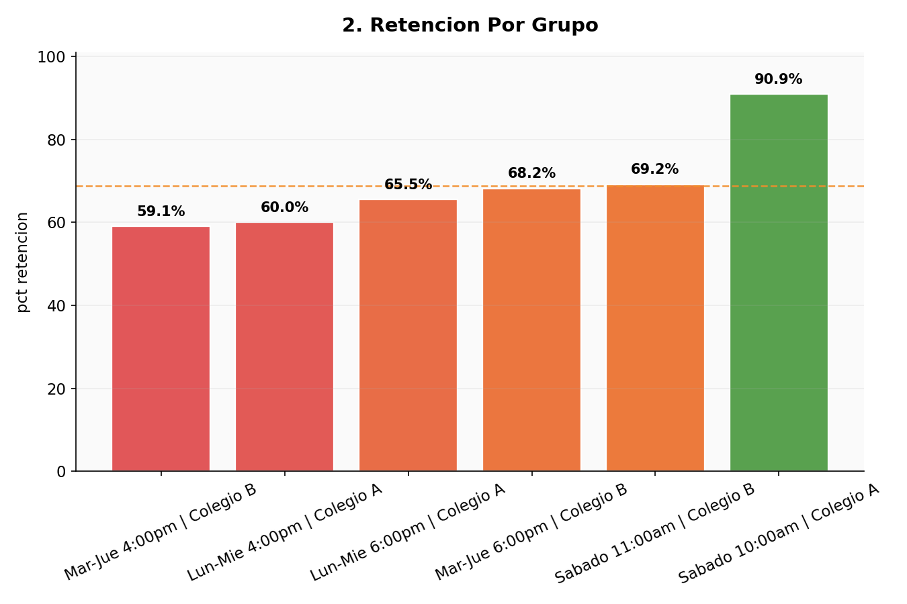
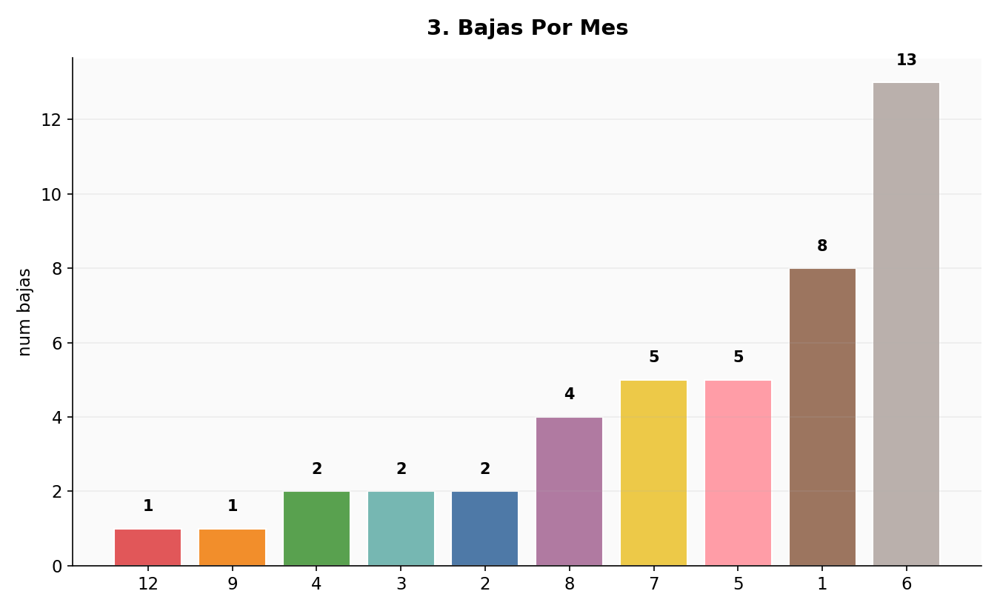
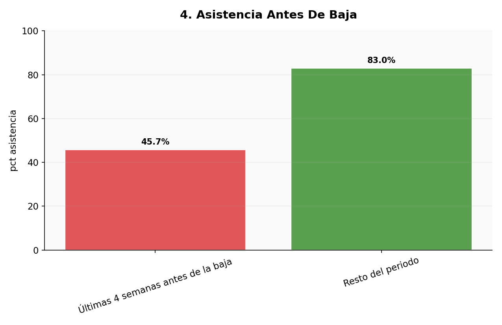

# 🥋 Análisis de Retención de Alumnos — Academia de Taekwondo

Proyecto de portafolio de Análisis de Datos: identifico patrones de retención y abandono
de alumnos en una academia de Taekwondo usando SQL, Python y visualización de datos.

> **Nota sobre los datos**: para proteger la privacidad de menores de edad, este proyecto
> usa datos **simulados** que replican patrones realistas de una academia real (basados
> en mi experiencia de 10 años como instructor), no información de alumnos reales.

---

## 📌 El problema

Como instructor de Taekwondo, una de las preguntas más importantes para el negocio es:
**¿por qué se van los alumnos, y se puede anticipar?** Este proyecto usa datos de
inscripciones, asistencia y pagos para responder esa pregunta con evidencia, no solo
intuición.

---

## 🗂️ Estructura de los datos

El dataset sigue un esquema relacional (Star Schema) con 6 tablas:

| Tabla | Tipo | Descripción |
|---|---|---|
| `alumnos` | Dimensión | Un registro por alumno: inscripción, estado, baja |
| `grupos` | Dimensión | Catálogo de horarios y colegios |
| `torneos` | Dimensión | Catálogo de eventos/torneos |
| `asistencia` | Hechos | Un registro por clase por alumno |
| `mensualidades` | Hechos | Historial de pagos |
| `participacion_torneos` | Hechos | Qué alumno fue a qué torneo |

---

## 🛠️ Metodología

1. **Generación de datos simulados** con Python (`generar_datos.py`), respetando
   relaciones y patrones realistas
2. **Carga a SQLite** (`cargar_db.py`) para consultar con SQL
3. **4 preguntas de negocio** respondidas con queries SQL (carpeta `/queries`)
4. **Visualización** de resultados con Python/matplotlib (`generar_graficas.py`)
5. Pipeline automatizado (`correr_queries.py` + `generar_graficas_auto.py`) para agregar
   preguntas nuevas sin repetir trabajo manual

---

## 📊 Hallazgos principales

### 1. El 39.5% de las bajas ocurren en los primeros 3 meses


Casi 4 de cada 10 alumnos que se dan de baja lo hacen antes de cumplir 90 días.
**Recomendación**: seguimiento activo con los padres en las primeras 4-8 semanas, el
periodo de mayor riesgo.

### 2. Los horarios de 4:00pm retienen 30 puntos menos que los sábados



Sábado 10am tiene 90.9% de retención vs. 59-60% en los horarios de 4pm entre semana,
probablemente por cansancio tras la jornada escolar. **Recomendación**: evaluar mover
grupos de 4pm a horarios posteriores cuando sea operativamente posible.

### 3. Enero y junio concentran más bajas



Coincide con el regreso de vacaciones de invierno y el fin de ciclo escolar.
**Recomendación**: campañas de recordatorio/reinscripción 2 semanas antes de estos
periodos, en vez de reaccionar después.

### 4. La asistencia cae antes de una baja — señal de alerta temprana



En las últimas 4 semanas antes de darse de baja, la asistencia cae de forma marcada.
Esto convierte la asistencia en un **indicador predictivo**, no solo descriptivo.
**Recomendación**: un sistema de alerta simple (2+ faltas en 2 semanas → contacto
directo) podría anticipar bajas antes de que ocurran.

📄 **Ver análisis completo con contexto y recomendaciones detalladas**:
[insights/hallazgos_y_recomendaciones.md](insights/hallazgos_y_recomendaciones.md)

---

## 📁 Estructura del repositorio

```
analisis-retencion-taekwondo/
├── README.md
├── generar_datos.py              # genera los datos simulados
├── cargar_db.py                  # carga los CSV a SQLite
├── correr_queries.py             # corre automáticamente todas las queries
├── generar_graficas.py           # gráficas principales (4 hallazgos)
├── generar_graficas_auto.py      # gráficas automáticas para queries nuevas
├── taekwondo.db
├── data/                         # datos simulados (6 tablas)
├── queries/                      # archivos .sql de cada pregunta
├── resultados/                   # resultados de cada query en CSV
├── Visualizaciones/              # gráficas en PNG
└── insights/                     # análisis extendido con recomendaciones
```

---

## 🧰 Herramientas usadas

SQL (SQLite) · Python (pandas, matplotlib) · Modelado relacional (Star Schema) · Git/GitHub

---

## 📫 Contacto

- LinkedIn: [https://www.linkedin.com/in/juan-jesus-sifuentes-zuazua-a8600a240/]
- GitHub: [github.com/juanjsizua-wq](https://github.com/juanjsizua-wq)